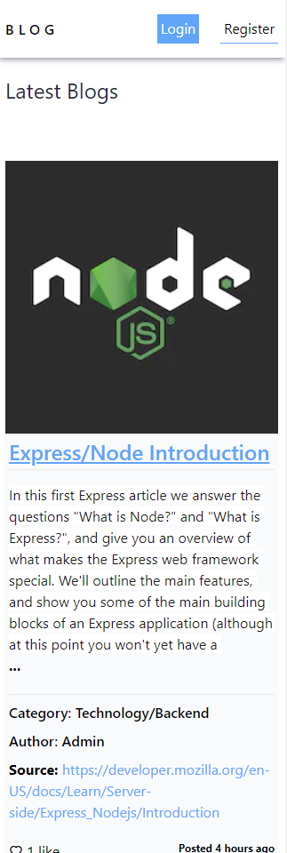
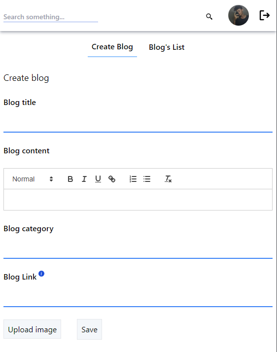
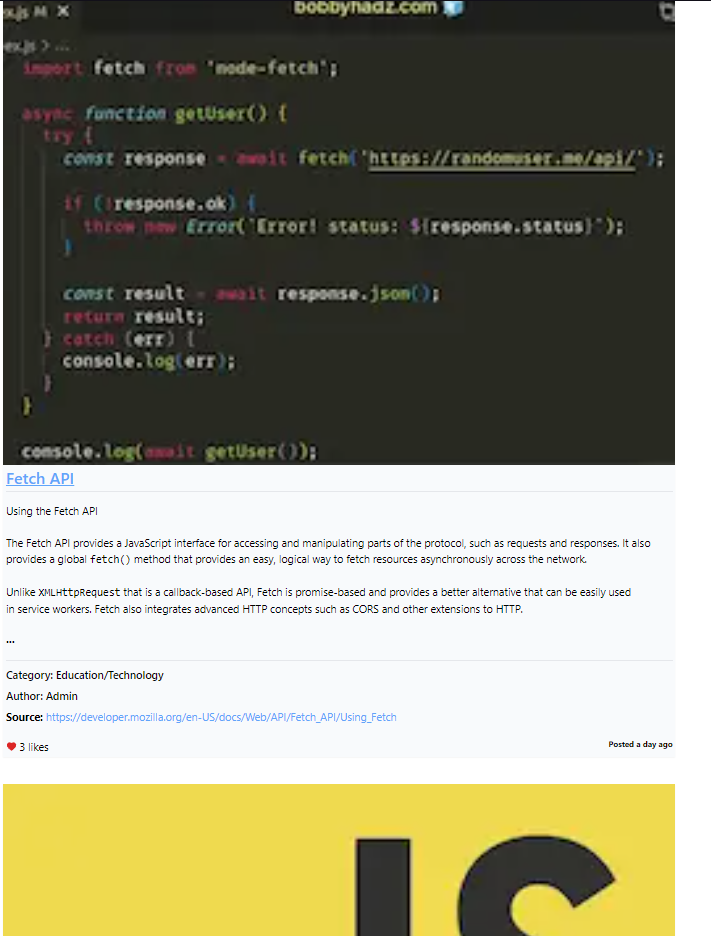

# NextBlog 💻





>  A modern and responsive Fullstack Blog made with ❤️!

Check the app: <a href="https://nextblog-rho-sooty.vercel.app/" target="_blank" rel="noopener noreferrer">https://nextblog-rho-sooty.vercel.app/</a><br>

## Explanation

**Next Blog** is a Fullstack NextJS 13 app where you register and signin, see and search for blogs and save them. As admin you are able to create/edit/delete blogs.

## 📱 Mobile First Methodology

This app was designed and developed using **Mobile First Methodology**, that involves designing a site starting with the mobile version, which is then adapted to larger screens.

## 🔐 Google Authentication

You can also signin in the app with google sync using your google account. We'll save the necessary data so you can explore the app in our database.


## 🔧 Versioning
- [x] Version 1.0:

## :rocket: Technologies ##

The following technologies was used on this project:

- [NextJs](https://nextjs.org/)
- [MongoDB](https://www.mongodb.com/docs/)
- [Cloudinary](https://cloudinary.com/)
- [Tailwindcss](https://tailwindcss.com/)
- [ReactJs](https://pt-br.reactjs.org/)
- [Typescript](https://www.typescriptlang.org/)

## :closed_book: Requirements ##

Before begin :checkered_flag:, you have to got [Git](https://git-scm.com) and [Node](https://nodejs.org/en/) installed.

## :checkered_flag: Starting ##

```bash
# Clone this project
$ git clone https://github.com/jguilhermesl/devs-social-network
# Access
$ cd devs-social-network
# Install dependencies
$ yarn or npm 
# Run the project
$ yarn start or npm start 
# The server will initialize in the <http://localhost:3000>
```
## 🤝 Colaborators

Thanks to the following people who contributed to this project:

<table>
  <tr>
    <td align="center">
      <a href="#">
        <br>
          <sub>
            <b>Marcus Begheli</b>
          </sub>
        </a>
      </td>
  </tr>
</table>

## 📝 License

This project is under license. See the file [LICENSE](LICENSE.md) to get more details.

<a href="#top">Get back to top</a>
